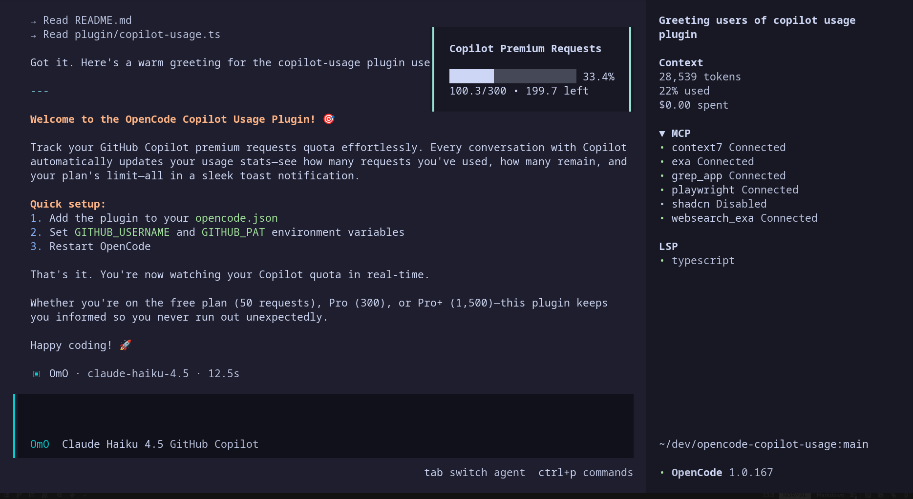

# opencode-copilot-usage-toast

A plugin for [OpenCode](https://opencode.ai) that displays your GitHub Copilot premium requests quota after each conversation.

Inspired by [sst/opencode#768](https://github.com/sst/opencode/issues/768).

**Note:** GitHub's billing API has a delay. Usage may take a few minutes to update.

## How it looks



## How it works 

1. Listens for the `session.idle` event (when a conversation ends).
2. Checks if the last message came from `github-copilot`.
3. Makes a direct `GET` request to GitHub's official Billing API:
   `https://api.github.com/users/{USERNAME}/settings/billing/premium_request/usage`
4. Calculates usage and displays a local toast notification.

## Installation

### 1. Add to opencode.json (remove the comments if you're not using .jsonc)

```jsonc
// you can add @1.0.2 at the end of the string to pin the version "opencode-copilot-usage-toast@1.0.2"
{
  // ... (your already existing config)
  "plugin": [
  // ... other plugins you have
  "opencode-copilot-usage-toast", 


  ],
}
```

### 2. Set environment variables

| Variable | Required | Description |
|----------|----------|-------------|
| `GITHUB_USERNAME` | Yes | Your GitHub username |
| `GITHUB_PAT` | Yes | [Fine-grained PAT](https://github.com/settings/personal-access-tokens/new) with **Plan -> Read-only** permission |
| `COPILOT_QUOTA` | No | Your plan limit: `50` (free), `300` (pro, default), `1500` (pro+) |

**macOS / Linux** (Modify your run commands file `~/.bashrc`, `~/.zshrc`, `~/.config/fish/config.fish`):
```bash
export GITHUB_USERNAME="your-username"
export GITHUB_PAT="github_pat_xxxx"
export COPILOT_QUOTA=1500  # optional, defaults to 300 (pro usage)
```

**Windows** (PowerShell profile via `code $PROFILE`): (I don't use windows, untested)
```powershell
$env:GITHUB_USERNAME = "your-username"
$env:GITHUB_PAT = "github_pat_xxxx"
$env:COPILOT_QUOTA = "1500"  # optional, defaults to 300
```

> **tip:** If your dotfiles are public (GitHub, chezmoi, etc.), store secrets in a separate file:
>
> 1. Create `~/.secrets.env` (add to your global `.gitignore`):
>    ```bash
>    export GITHUB_USERNAME="your-username"
>    export GITHUB_PAT="github_pat_xxxx"
>    ```
>
> 2. Source it from your shell config (`~/.bashrc`, `~/.zshrc`):
>    ```bash
>    [ -f ~/.secrets.env ] 
>    ```
>
> This keeps your tokens out of version control.

### 3. Restart OpenCode

---

## Token Creation (Detailed)

1. Go to [**GitHub Personal Access Tokens**](https://github.com/settings/personal-access-tokens)

2. Click **"Generate new token"** → **"Fine-grained token"**

3. Fill in the form:
   - **Token name:** `opencode-copilot-usage` (or any name you want)
   - **Expiration:** 90 days (or your preference)
   - **Resource owner:** Select your username

4. Under **"Repository access"**, select:
   - `Public Repositories (read-only)` or `No access`

5. Expand **"Account permissions"** and set:
   - **Plan** → `Read-only`

6. Click **"Generate token"**

7. Copy the token (starts with `github_pat_`) and save it somewhere safe

## Troubleshooting

**"Failed to fetch quota"**
- Verify your PAT has **Plan (read-only)** permission
- Check `GITHUB_USERNAME` matches your GitHub handle exactly

## License

MIT
